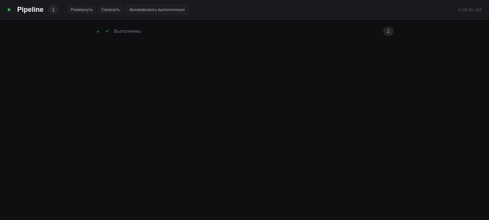

# Pipeline Dashboard

Real-time web dashboard for [Hermes Pipeline Plugin](https://hermes-agent.nousresearch.com/docs).
Shows pipeline tasks, agent flows, and statuses — updated live via SSE.



## Quick Start

Сервер на чистом Python stdlib — ноль внешних зависимостей.

```bash
cd ~/git/pipeline-dashboard
hermes kanban boards create pipeline   # only once
python3 server.py                       # слушает 0.0.0.0:8800
```

Открыть **http://localhost:8800**

## Features

- **Pipeline groups** — tasks grouped by status: Выполняется, Готовы, Заблокированы, В очереди, Выполнены, Архив
- **Progress bars** — done/total для каждого пайплайна, анимированные для running
- **Agent flow** — визуальная цепочка агентов в порядке pipeline (finder → analyst → coder → ...)
- **Auto-expand** — активные задачи (running/ready/blocked) автоматически развёрнуты
- **Auto-collapse** — выполненные задачи сворачиваются
- **Real-time SSE** — `/api/events` присылает `full_update` при любых изменениях
- **Actions** — Удалить (с двойным подтверждением), Архив, Перезапустить, Сброс
- **Dark theme** — минималистичный тёмный UI
- **Heartbeat** — ping каждые 6s, при reconnect экспоненциальный backoff

## Architecture

```
kanban.db ──sqlite3──→ server.py ──SSE──→ index.html
  (read-only)            ↑
                    Python stdlib:
                    http.server + sqlite3
                    ни одного subprocess
```

## API

| Endpoint | Method | Description |
|----------|--------|-------------|
| `GET /` | HTML | Dashboard SPA |
| `GET /api/tasks` | JSON | Все pipeline-задачи с детьми и прогрессом |
| `GET /api/events` | SSE | Real-time поток: только `full_update` |
| `POST /api/tasks/:id/archive` | JSON | Архивировать задачу |
| `POST /api/tasks/:id/rerun` | JSON | Сбросить в ready для перезапуска |
| `POST /api/tasks/:id/reset` | JSON | Полный сброс (удалить run из task_runs) |
| `DELETE /api/tasks/:id/delete` | JSON | Удалить задачу (с детьми) |

### SSE Events

Единственное событие: `full_update`. Приходит после любого изменения.

```
event: full_update
data: [{"id":"t_xxx","title":"🔷 Пайплайн: ...","status":"running",...}, ...]
```

Пинг каждые 6 секунд:

```
event: ping
data: {"timestamp": "..."}
```

## Requirements

- Python 3.11+
- Hermes со включённым Pipeline Plugin
- Созданный kanban board `pipeline`

## Configuration

Переменные окружения:

| Variable | Default | Description |
|----------|---------|-------------|
| `HOST` | `0.0.0.0` | IP для привязки |
| `PORT` | `8800` | HTTP порт |

```bash
HOST=127.0.0.1 PORT=8801 python3 server.py
```

## Project Structure

```
pipeline-dashboard/
├── server.py              # Backend: http.Server + sqlite3 + SSE
├── static/
│   └── index.html         # SPA dashboard (vanilla JS, ~425 строк)
├── AGENTS.md              # Hermes agent guide
├── README.md              # This file
├── screenshot.png         # Скриншот дашборда
├── requirements.txt       # (пустой — ноль зависимостей)
├── .gitignore
├── pyproject.toml
├── .github/workflows/ci.yml
└── run.sh
```

## Notes

- Прямое чтение `~/.hermes/kanban/boards/pipeline/kanban.db` через `sqlite3`
- Никаких subprocess вызовов — только SELECT
- Транзакции read-only: `BEGIN DEFERRED`, закрываются в `finally`
- CSP: `default-src 'self' 'unsafe-inline'`
- Статусы: `triage`, `todo`, `ready`, `running`, `blocked`, `done`, `archived`
